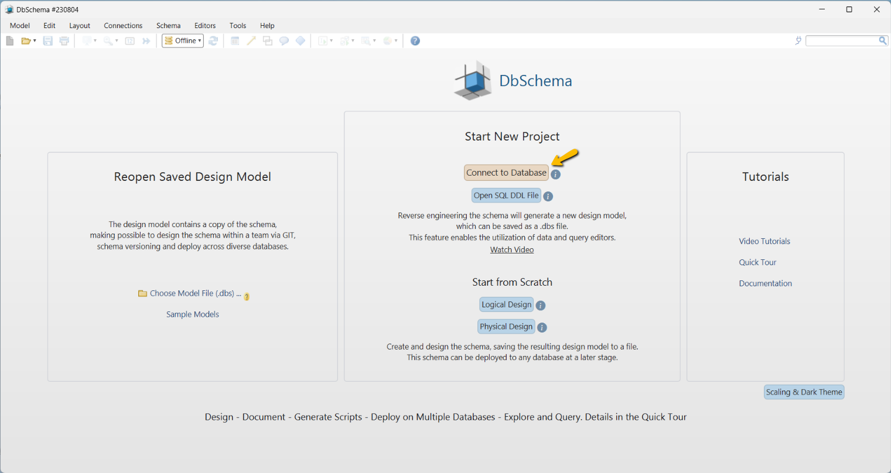

## Docker - Adicionando Banco NoSQL HBase 2.2.5 no cluster Hadoop 3.3.5

**Apache Hbase** é um banco NoSQL da categoria de famílias de colunas que roda sobre o **HDFS** no seu Data Lake Hadoop.

Com Apache HBase você adiciona uma camada extra de armazenamento e consequentemente de análise sobre seu Data Lake o que vai facilitar  e muitos suas análises e interações sobre os dados estruturado, semiestruturados e principalmente sobre os dados não estruturados que estão no HDFS.

Por ser um banco **NoSQL**, sua linguagem default de interação não é o **SQL**, o que para muitos possa exigir uma curva de aprendizado um pouco maior sobre como operá-lo, mas é possível integrá-lo ao **Apache Phoenix**, o que adiciona uma camada abstrata de SQL, e assim se torna possível rodar **SQL** sobre o **HBase**.

No passo a passo a seguir será construído um cluster distribuído **Apache HBase** integrado com o **Apache Phoenix** que no final será integrado com o **Data Lake Hadoop**.

### Requisitos mínimos

Ter em seu SO host e ambiente os seguintes software e recursos.
Abaixo segue o link para download.

- Docker (Software para criação e administração de containers)

  https://docs.docker.com/get-docker/

  Se quiser montar um ambiente com docker completamente isolado do seu SO no tutorial abaixo mostro como fazer isso.

  https://github.com/tiagotsc/vagrant-docker

- Hadoop (Data Lake Hadoop em execução)

  No link abaixo mostro o passo a passo de como criar um.

  https://github.com/tiagotsc/docker-hadoop

- Dbeaver (IDE para acessar diversos bancos)

  https://dbeaver.io/download/

- DBSchema (IDE para acessar diversos bancos)

  https://dbschema.com/download.html
  

### Siga as etapas

1 - Crie uma pasta com nome de sua preferência em qualquer lugar do seu SO. No meu caso vou chama lá de “**hbase**”.

````bash
# Cria a pasta
mkdir hbase
# Entra na pasta
cd hbase
````

2 - Dentro da pasta **hbase**, crie as pastas **binarios** e **config-files**, conforme exemplo da figura abaixo:


3 - Faça o download do **Apache HBase 2.5.5**, **Apache Phoenix 2.5** e o **Java JDK 1.8**, e descompacte em qualquer lugar.

Segue link dos binários, lembrando que os links podem mudar com o tempo:

- HBase 2.2.5

  https://dlcdn.apache.org/hbase/2.5.5/hbase-2.5.5-bin.tar.gz

- Phoenix 5.1.3

  https://www.apache.org/dyn/closer.lua/phoenix/phoenix-5.1.3/phoenix-hbase-2.5-5.1.3-bin.tar.gz

- Java JDK 1.8 (Exemplo: Linux x64 jdk-8u202-linux-x64.tar.gz)

  https://www.oracle.com/br/java/technologies/javase/javase8-archive-downloads.html

```bash
# Descompacta os arquivos
tar -xvf hbase-2.5.5-bin.tar.gz
tar -xvf phoenix-hbase-2.5-5.1.3-bin.tar.gz
tar -xvf jdk-8u202-linux-x64.tar.gz
```

Observação: No meu caso como estou usando o **Vagrant** e a pasta **projeto** é compartilhada entre Windows e Linux, fiz a descompactação em outra pasta dentro da VM, por causa do conflito no link simbólico.

4 - Renomeie a pasta **hbase-2.5.5-bin** para **hbase**, **phoenix-hbase-2.5-5.1.3-bin** para **phoenix** e **jdkx.x.x.x** para **jdk**, e faça a cópia para a pasta **binarios**.

```bash
# Renomeando pastas dos arquivos descompactados
mv hbase-2.5.5 hbase
mv jdk1.8.0_202/ jdk
mv phoenix-hbase-2.5-5.1.3-bin phoenix
# Fazendo a cópia para a pasta binarios
cp -R hbase ~/hbase/binarios/
cp -R phoenix ~/hbase/binarios/
cp -R jdk ~/hbase/binarios/
```

Como ficará o diretório **binarios** da pasta **hbase**, por exemplo:


### Os passos abaixo devem ser executados apenas na pasta hbase criada anteriormente

1 - Entre na pasta **hbase** e crie o arquivo **Dockerfile**, sem extensão.

```bash
# Entrar na pasta hbase
cd ~/hbase/
# Cria o arquivo Dockerfile
touch Dockerfile
```

Esse arquivo conterá todos os recursos e configurações necessárias que nossa imagem Hbase precisará.

2 - Adicione o seguinte conteúdo no arquivo **Dockerfile** e salve.

https://github.com/tiagotsc/docker-hive/blob/ae1966f5842a513ec0ac8c187ac84fffa4eff53f/hive_3.1.3/Dockerfile#L1-L233

3 - Na pasta onde tem o **Dockerfile**, crie o arquivo **script.sh** e adicione o conteúdo:

https://github.com/tiagotsc/docker-hive/blob/ae1966f5842a513ec0ac8c187ac84fffa4eff53f/hive_3.1.3/script.sh#L1-L11

Esse arquivo fará o ajuste de privilégios na nossa imagem.

4 - Na pasta **config-files**, que foi criada anteriormente, adicione os arquivos que estão presentes na pasta **hbase/config-files** desse repositório.

Esses arquivos possuem as configurações necessárias para configurar o cluster **HBase** e para possibitar a integração´com nosso **Data Lake Hadoop**.

5 - Agora já podemos construir a imagem, estando na pasta **hbase** que contém o arquivo **Dockerfile**, execute:

```bash
# Constrói a imagem
docker build . -t hbase_cluster:2.5.5
```

6 - Imagem criada, já é possível subir os containers.

Importante: O container precisa estar na mesma rede do DataLake para que eles possam se comunicar e os hostnames (hbase-master,hbase-regionservers1,hbase-regionservers2) dos containers precisam ser respeitados, pois as configurações estão atreladas e eles.

````bash
# No meu caso a rede é: hadoop_dl_net
# Comando usado para criar rede: 
docker network create -d bridge hadoop_dl_net

# Suba  o container do HBMaster
docker run -dit --net hadoop_dl_net --hostname hbase-master --name hbase-master -p 16000:16000 -p 16010:16010 -p 2181:2181 --privileged hbase_cluster:2.5.5 /usr/sbin/init

````

7 - Como estamos usando um única VM, para não haver conflito de portas vou subir **os regionsservers** personalizando as portas para não ocorrer coflitos.

**Obs.:** Isso é um ambiente Kubernetes, por exemplo, não seria necessário.

````bash
# Suba o container Region Server 1
docker run -dit --net hadoop_dl_net --hostname hbase-regionservers1 --name hbase-regionservers1 -p 16020:16020 -p 16030:16030 --privileged hbase_cluster:2.5.5 /usr/sbin/init

# Suba o container Region Server 2
docker run -dit --net hadoop_dl_net --hostname hbase-regionservers2 --name hbase-regionservers2 -p 16021:16021 -p 16031:16031 --privileged hbase_cluster:2.5.5 /usr/sbin/init

# Entre no container hbase-regionservers1 e adicione os atributos no arquivo hbase-site.xml dentro da tag configuration
docker exec -u hduser -it hbase-regionservers1 /bin/bash
vi ~/hbase/conf/hbase-site.xml

  <property>
    <name>hbase.regionserver.port</name>
    <value>16020</value>
  </property>

  <property>
      <name>hbase.regionserver.info.port</name>
      <value>16030</value>
  </property>

# Entre no container hbase-regionservers2 e adicione os atributos no arquivo hbase-site.xml dentro da tag configuration
docker exec -u hduser -it hbase-regionservers2 /bin/bash
vi ~/hbase/conf/hbase-site.xml

  <property>
    <name>hbase.regionserver.port</name>
    <value>16021</value>
  </property>

  <property>
      <name>hbase.regionserver.info.port</name>
      <value>16031</value>
  </property>

````

8 - Entre no container hbase-master e execute os passos.

````bash
# Entre no container usando o usuário hduser
docker exec -u hduser -it hbase-master /bin/bash

# Inicie o cluster HBase
$HBASE_HOME/bin/start-hbase.sh

# Se tudo estiver rodando corretamento, você terá acessa a seguinte tela no navegador:
http://IP_VM:16010
````


#### Enviando a imagem HBase para o DockerHub

````bash
# Logue no Docker
docker login

# Depois que tiver construído localmente sua imagem, crie a tag apontando para a imagem criada
docker image tag hbase:2.5.5 SEU_USUARIO_DOCKER/hbase:2.5.5

# Envie a imagem
docker image push SEU_USUARIO_DOCKER/hbase:2.5.5
````

### Acessando internamente o HBase de dentro do container hbase-master

Esse acesso pode ser feito de 2 forma:

- 1ª forma: HBase shell
  ````bash
  # Para acessar o Hive, execute
  hbase shell

  # Sair
  exit
  ````

- 2ª forma: Phoenix JDBC
  ````bash
  # Acessando através do Phoenix
  python3 $PHOENIX_HOME/bin/sqlline.py localhost:2181

  # Sair do Phoenix
  !q
  ````

### Configurando o arquivos de hosts

Adicione o IP e DNS de cada container na sua máquina Host.

````bash
# No Windows, o arquivo fica em:

C:\Windows\System32\drivers\etc\hosts

# No Linux, o arquivo fica em:

/etc/hosts

````

No meu caso minha VM é, 192.168.56.200

````bash
192.168.56.200 hbase-regionservers1
192.168.56.200 hbase-regionservers2
192.168.56.200 hbase-regionservers1.hadoop_dl_net
192.168.56.200 hbase-regionservers2.hadoop_dl_net
192.168.56.200 hbase-master
````

### Acessando o Hbase externamente através do DBeaver
**Versão testada: DBeaver 23.1.4**

Obs.: No meu caso acessarei de uma máquina Windows

Depois de ter instalado no **DBeaver** no seu SO, execute a cópia do JAR descrito abaixo.

No mesmo arquivo zipado **phoenix-hbase-2.5-5.1.3-bin.tar** que baixou, copie o arquivo **phoenix-client-hbase-2.5.jar** e coloque na pasta de plugins do DBeaver **C:\Users\SEU_USUARIO\AppData\Local\DBeaver\plugins**

Após a cópia você já pode abrir o DBeaver

Na tela principal, na caixa de busca digite **Phoenix**, clique no ícone do **Apache Phoenix** e clique em **Avançar**.


Na próxima tela, no campo **Host** informe o **IP** da sua **VM** onde está rodando o **HBase** e clique no botão **Configurações de driver**.

No meu caso, minha **VM** é **192.168.56.200**.


Na janela que ser abre clique na aba **Libraries**.


Na aba **Libraries** remova as bibliotecas, selecionando-as e clicando no botão de **Excluir**, conforme figura abaixo.


Depois clique no botão **Adicionar arquivo** e selecione o arquivo **phoenix-client-hbase-2.5.jar** que você colocou na pasta **C:\Users\SEU_USUARIO\AppData\Local\DBeaver\plugins**.

Depois clique no botão **Encontrar classe**


Na janela que se abre, clique em **Download**


Depois na combo **Driver class**, selecione o driver e clique em **OK**


Agora clique na aba **Driver properties** e adicione os 2 atributos com seus respectivos valores e depois clique no botão **Testar conexão...**.

| Atributo   | Valor       |
| :---------- | :--------- |
| phoenix.schema.isNamespaceMappingEnabled | true |
| phoenix.schema.mapSystemTablesToNamespace | false |


Se tudo ocorrer bem, vai aparecer o seguinte pop-up.

Para finalizar é só clicar em **Ok** e depois em **Concluir**


**DBeaver** conectado no seu **Data Lake Hadoop** e pronto para uso!


### Acessando o Hbase externamente através do DbSchema
**Versão testada: DbShema 9.4.1 build 230804**

Obs.: No meu caso acessarei de uma máquina Windows

Depois de ter instalado no DBSchema no seu SO, execute a cópia do JAR descrito abaixo.

Do mesmo arquivo zipado **phoenix-hbase-2.5-5.1.3-bin.tar** que baixou, copie o arquivo **phoenix-client-hbase-2.5.jar** e coloque na pasta (crie a pasta) de plugins do DBSchema **C:\Users\SEU_USUARIO\.DbSchema\drivers\HBase**

Após a cópia você já pode abrir o DBSchema.

Na tela principal clique em **Conect to Database**



Na na tela que se abre, na caixa de busca digite **hbase**, clique no ícone que aparece e depois clique em **Next**.


Na próxima tela, na combo **JDBC URL** selecione **Standard**, no campo **Server Host or IP**, informe o IP da sua VM e no campo **Port**, coloque porta **2181** e depois clique na aba **Settings**.


Na aba **Settings**, informe os 2 parâmetros da seguinte forma e clique em **Connect**

````bash
phoenix.schema.isNamespaceMappingEnabled=true;phoenix.schema.mapSystemTablesToNamespace=false
````


Na próxima janela, selecione o banco **default** e clique em **Ok**


**DBSchema** conectado e pronto para uso.


Show! Foi mostrado 2 formas de conexão e agora é só interagir com seu **Data Lake** manipulando dados **estruturados**, **semi-estruturados** e principalmente **não estruturados** através do **Apache Phoenix** que vai no **Apache HBase** usando o amigável **SQL**.

#### Parando cluster HBase

````bash
# No container hbase-master, execute
$HBASE_HOME/bin/stop-hbase.sh
````

#### Concluiu todo o passo a passo e desejava remover os recursos criados, execute os comandos abaixo:

````bash
docker rm -f hbase-master hbase-regionservers1 hbase-regionservers2
docker image rm hbase_cluster:2.5.5
docker image rm SEU_USUARIO_DOCKER/hbase_cluster:2.5.5
docker network rm hadoop_dl_net
````

### Alguns comandos úteis

```bash
##### VAGRANT - é preciso estar na pasta que contém o Vagrantfile #####

# Liga VM, ou cria, caso ainda não exista
vagrant up

# Desliga a VM
vagrant halt

# Reiniciar a VM
vagrant reload

# Destrói a VM, mas pergunta antes
vagrant destroy

# Destrói a VM sem perguntar
vagrant destroy -f

##### DOCKER #####

# Listar redes
docker network ls

# Listar containers parados e em execução
docker container ls -a

# Listar imagens
docker image ls

# Se quiser parar o container criado
docker container stop hbase-master

# Se quiser iniciar o container que já tinham sido criado em algum momento, caso esteja parado
docker container start hbase-master

# Se quiser remover os container
docker container rm -f hbase-master

# Se quiser remover as imagens criada
docker image rm hbase_cluster:2.5.5

# Criar container a partir da imagem remota, caso tenha enviado para o DockerHub
docker run -dit --net hadoop_dl_net --hostname hbase-master --name hbase-master -p 16000:16000 -p 16010:16010 -p 2181:2181 --privileged SEU_USUARIO_DOCKER/hbase_cluster:2.5.5 /usr/sbin/init

# Puxar só a imagem remota, caso tenha enviado para o DockerHub
docker pull SEU_USUARIO_DOCKER/hbase_cluster:2.5.5

# Remove localmente imagem obtida do DockerHub
docker image rm SEU_USUARIO_DOCKER/hbase_cluster:2.5.5

# Ficou sem espaço no seu ambiente Docker
# Cuidado! esse comando apaga vários recursos criados pelo Docker, só é recomendado em ambientes puramente de testes
docker system prune --all --force
```

Todo o tutorial aplicado aqui, já se encontra pronto para uso nesse repositório, se você tiver em seu SO o **Vagrant** e **VirtualBox**, basta clonar, subir o ambiente, baixar os binários e seguir os passos de construção das imagens e consequentemente containers.

O passo a passo foi desenvolvido encima do **Vagrant 2.3.3** e **VirtualBox 7.0.6**.

#### Documentação oficial do Vagrant

https://developer.hashicorp.com/vagrant/docs

#### Documentação oficial Docker
https://docs.docker.com/

#### Documentação oficial Hadoop 3.3.5
https://hadoop.apache.org/docs/r3.3.5/

#### Documentação oficial Hive 3.3.1
https://hive.apache.org/

https://cwiki.apache.org/confluence/display/Hive/

https://www.devdoc.net/bigdata/hive-confluence-20210220/display/Hive/Home.html

#### Documentação oficial Yarn Timeline Server
https://hadoop.apache.org/docs/current/hadoop-yarn/hadoop-yarn-site/TimelineServer.html

#### Documentação Apache Tez
https://tez.apache.org/

#### Documentação oficial Apache Yarn
https://hadoop.apache.org/docs/current/hadoop-yarn/hadoop-yarn-site/YARN.html

#### Tutorial sobre Apache TOMCAT
https://www.digitalocean.com/community/tutorials/how-to-install-apache-tomcat-7-on-centos-7-via-yum

## 🔗 Links
[](https://www.linkedin.com/in/tiago-s-costa)
